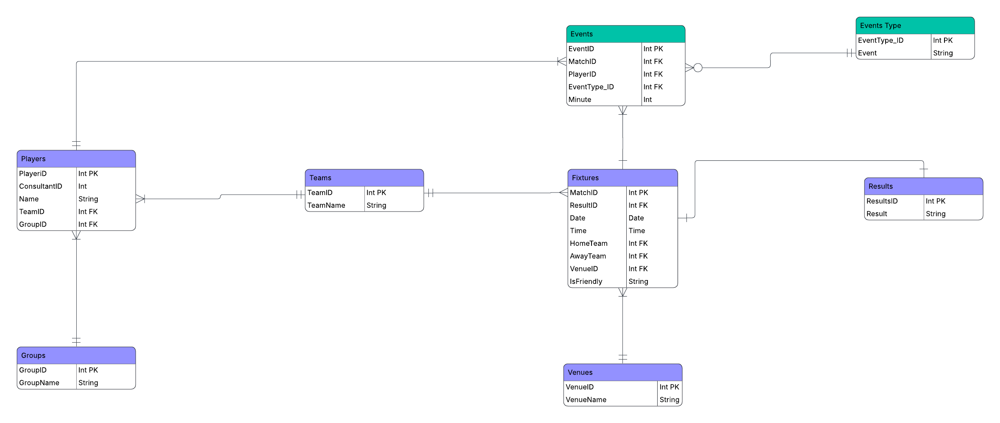

# Rockborne Football League Database (PostgreSQL)

## Project Overview

This project involved designing, implementing, and testing a relational database for managing a **6-a-side football tournament** organised by Rockborne.

The system stores and manages information about:

- Teams
- Players
- Fixtures
- Match results
- Goals and cards
- Venues

The objective was to design a **normalised relational database**, implement it in **PostgreSQL**, and test the system using SQL queries.

---

## Objectives

The main goals of this project were:

- Design a relational database using **Entity Relationship modelling**
- Apply **database normalisation up to Third Normal Form (3NF)**
- Implement the schema using **PostgreSQL**
- Populate the database with tournament data
- Test the database with SQL queries to validate functionality

---

## Technologies Used

- **PostgreSQL**
- **pgAdmin**
- **SQL**
- **Excel** (for data preparation and normalisation)

---

## Database Design

The database was designed using **Entity Relationship modelling** and structured following the principles of the **Relational Model**.

Key design considerations included:

- Eliminating data redundancy
- Defining primary and foreign keys
- Enforcing relational integrity
- Structuring tables to achieve **Third Normal Form (3NF)**

---

## Entity Relationship Diagram



---

## Project Structure

```
rockborne-football-league-database
│
├── README.md
│
├── docs
│   ├── database_design_documentation.pdf
│   └── database_implementation_documentation.pdf
│
├── sql
│   ├── schema.sql
│   ├── sample_data.sql
│   └── test_queries.sql
│
├── data
│   └── normalisation_process.xlsx
│
└── erd
    └── er_diagram.png
```

---

## Example SQL Queries

### 1. List all students who play for a specific cohort/group

```sql
SELECT student_name
FROM players
WHERE cohort_group = 'Group 4';
```

---

### 2. List fixtures for a specific date

```sql
SELECT match_date, team_home, team_away, venue
FROM fixtures
WHERE match_date = '2022-10-29';
```

---

### 3. Players who scored more than two goals

```sql
SELECT player_name, COUNT(goal_id) AS goals_scored
FROM goals
GROUP BY player_name
HAVING COUNT(goal_id) > 2;
```

---

## Testing

The database was tested using SQL queries designed to validate:

- Data relationships
- Tournament results
- Player performance
- Fixture scheduling

The results confirmed that the schema correctly supports tournament operations.

---

## Key Learning Outcomes

Through this project I developed practical experience in:

- Relational database design
- Data normalisation
- PostgreSQL database implementation
- Writing SQL queries for data retrieval and analysis
- Testing database functionality using real scenarios

---

## Future Improvements

Potential enhancements include:

- Adding stored procedures for automated scoring updates
- Implementing triggers for match result validation
- Developing a front-end interface for tournament management
- Expanding support for additional tournament formats

---

## Author

**Emmanuel Oloruntola**

Aspiring Data Analyst with experience in:

- SQL
- Python
- Data Analysis
- Data Visualisation
